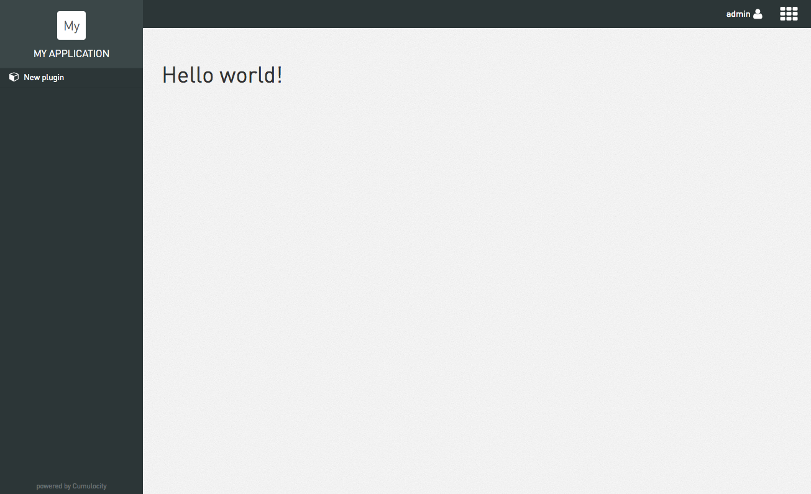
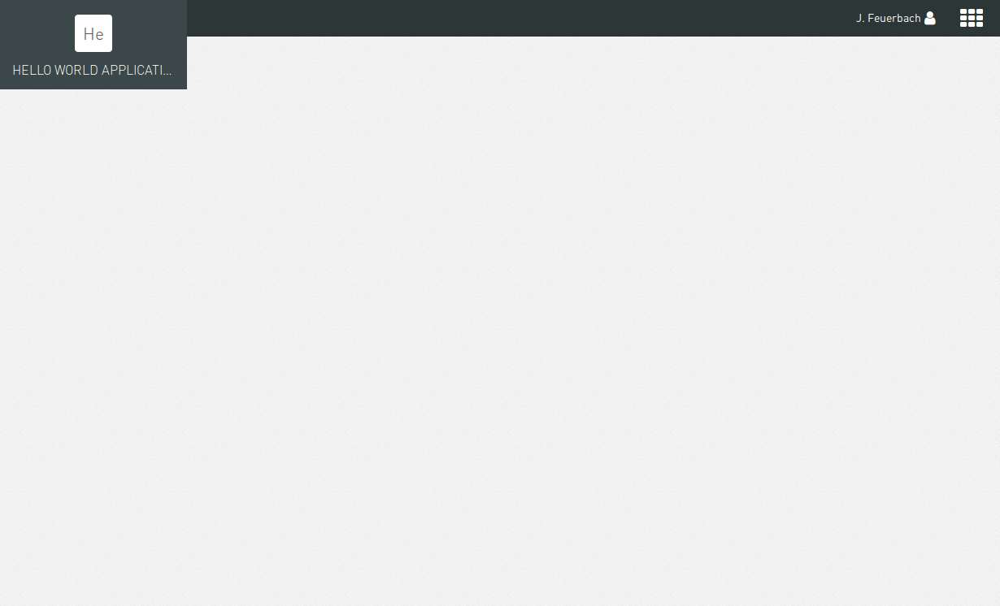

## Hello
开发第一个应用程序

这个程序将包含一个单一的菜单项，显示一个简单的"Hello world"页面。完成后如下图所示



为了实现这一目标，需要执行以下步骤:
* 创建一个应用程序项目。
* 配置应用程序清单。
* 在租户中注册应用程序。
* 配置插件清单。
* 实现插件的初始化函数以添加菜单项并将其与视图模板相关联。
* 实现控制器为视图模板提供数据(以一个简单的文本为例)。
* 添加视图模板以显示数据。
* 测试应用程序。
* 最后，构建并发布应用程序和插件。

### 创建应用程序项目
* 创建一个任意名称的新文件夹。
* 在此文件夹中创建一个"cumulocity.json"文件，代表我们的应用程序清单。
* 运行命令"npm init"来创建一个新的"package.json"文件。
* 运行命令"c8y install latest"获取最新的核心插件。
```
<<根文件夹>>
├── node_modules
│       └── ...
├── cumulocity.json
└── package.json
```

### 配置应用程序
在"cumulocity.json"文件中，我们填写一下应用程序信息

```
{
  "availability": "PRIVATE",
  "contextPath": "myapplication",
  "key": "myapplication-appkey",
  "name": "myapplication",
  "resourcesUrl": "/",
  "type": "HOSTED",
  "imports": [
    "core/c8yBranding"
  ]
}
```
### 在租户中创建应用程序
成功登录到QuarkIoE UI应用程序后，将自动提取应用程序密钥。 因此，为了开发应用程序，我们需要确保在我们的租户中创建应用程序。 要在我们的租户中创建应用程序，我们只需使用c8y deploy:app [appContextPath]部署它。 如果省略appContextPath，将从执行命令的路径上的"cumulocity.json"读取contextPath
```
$ c8y deploy:app myapplication //myapplication 你的应用名称
? Tenant piedpiper //你的租户
? User admin //你的用户名
? Password *********** //你的密码
? Base url https://piedpier.cumulocity.com //你的url
```
为了防止一次又一次地填写这些内容，您可以在计算机上定义以下环境变量: C8Y_TENANT, C8Y_USER, C8Y_PASS 和 C8Y_BASE_URL。

注册后的应用程序会出现在QuarkIoE系统管理应用程序的 "我的应用程序" 菜单。


### 测试应用程序
要在本地运行应用程序，只需运行c8y server。 你可以传递一个选项 `-u https://piedpier.cumulocity.com`，表示api调用被代理到哪里。（若已经配置了环境变量，不写 `-u` 将会代理到base_url中）
```
$ c8y server
Quarkioe UI development server running in port 9000.
Proxying api requests to https://bazinga.staging.c8y.io
140 modules loaded.
5 application manifest loaded.
http://localhost:9000/apps/myapplication/ cumulocity.json
http://localhost:9000/apps/fieldbus4/  Packaged App
http://localhost:9000/apps/administration/  Packaged App
http://localhost:9000/apps/cockpit/  Packaged App
http://localhost:9000/apps/devicemanagement/  Packaged App
```
您可以通过在URL "http://localhost:9000/apps/myapplication/" 打开浏览器来测试您的应用程序。如果您现在访问您的应用程序，您应该能够看到以下内容:



现在缺少的是一个插件，它添加一个菜单项到导航器。
### 配置插件清单
每个插件都在应用程序的plugins文件夹中的一个单独的子文件夹。 所以要添加一个插件到我们的应用程序，我们必须
* 在我们的项目中创建一个"plugins"文件夹
* 在"plugins"文件夹中创建一个名为"hello"的文件夹。
* 在"hello"文件夹中创建一个"cumulocity.json"文件，代表我们的应用程序清单。
* 在"hello"文件夹中创建"views"文件夹。
* 在"views"文件夹中创建一个"hello.html"文件，表示我们的插件的视图。

完成这些步骤后，您应该具有以下文件夹结构:
```
<<根目录>>
├── node_modules
├── plugins
│      └── hello
│             ├─ views
│             │    └─ hello.html
│             └── cumulocity.json
├── cumulocity.json
└── package.json
```
插件清单提供了有关我们插件的信息，例如名称，简短描述，要加载的文件和要添加到main应用程序的angular模块。 对于我们的示例，将以下行添加到"cumulocity.json"文件中:
```
{
  "name": "Hello world plugin testing",
  "description": "Simple hello world plugin."
}
```
现在我们已经为我们的应用程序添加了一个插件，我们还必须将它添加到我们的应用程序清单的导入中。 导入的名称由两个部分组成，以斜杠分隔。 第一部分必须是插件所在应用程序的上下文路径，第二部分必须是plugin文件夹的名称。 在我们的示例中，我们的插件位于我们的应用程序中，其中包含在应用程序清单中指定的上下文路径"myapplication"，我们的插件文件夹名为"hello"，在根目录下的"cumulocity.json"中配置，结果是:
```
{
  "availability": "PRIVATE",
  "contextPath": "myapplication",
  "key": "myapplication-appkey",
  "name": "myapplication",
  "resourcesUrl": "/",
  "type": "HOSTED",
  "imports": [
    "core/c8yBranding",
    "myapplication/myplugin"
  ]
}
```
在我们将plugin文件夹添加到我们的应用程序后，我们可以开始实现该功能。
### 实现插件的初始化函数
即使此示例的范围非常小，我们还是建议使用模块化方法。 因此，为该模块创建一个文件"hello.module.js"，为"hello"文件夹中的控制器创建一个文件"hello.config.js"和一个文件"hello.controller.js"。

在"hello.module.js"文件中，我们初始化了插件的模块:
```
(function () {
  'use strict';

  angular.module('myapp.hello', []);
}()); //注意：这里的分号不能舍，省去的话在打包应用的时候会出错
```
在我们的"hello.config.js"文件中，我们必须配置我们的插件，以便它添加一个菜单项到导航器，并重定向到我们的视图，当点击这个菜单项。 为此，我们可以使用由QuarkIoE JavaScript API提供的服务"c8yNavigatorProvider"和"c8yViewsProvider"。 只需将服务注入到您的配置并调用以下函数:
```
(function () {
  'use strict';

  angular
  .module('myapp.hello')
  .config(configure);

  configure.$inject = [
  'c8yNavigatorProvider',
  'c8yViewsProvider'
  ];

  function configure(
  c8yNavigatorProvider,
  c8yViewsProvider
  ) {
  c8yNavigatorProvider.addNavigation({ // adds a menu item to the navigator with ...
  name: 'hello', // ... the name *"hello"*
  icon: 'cube', // ... the cube icon (icons are provided by the great Font Awesome library and you can use any of their [icon names](http://fontawesome.io/icons/) without the *fa-* prefix here
  priority: 100000, // ... a priority of 100000, which means that all menu items with a priority lower than 100000 appear before this menu item and all with a priority higher than 100000 appear after this menu item
  path: 'hello' // ... */hello* as path
});

  c8yViewsProvider.when('/hello', { // when the path "/hello" is accessed ...
  templateUrl: ':::PLUGIN_PATH:::/views/hello.html', //  ... display our html file "hello.html" inside the "views" folder of our plugin (the plugin's folder is represented using the magic string ```:::PLUGIN_PATH:::```, which is replaced by the actual path during the build process)
  controller: 'HelloController', // ... use "HelloController" as controller
  controllerAs: 'vm'
    });
  }
}());
```
### 实现控制器
下面我们实现视图控制器"Hello.controller.js"。对于这个例子，控制器只是定义了一个变量"text"，它包含简单的静态文本"hello, world":
```
(function () {
  'use strict';

  angular
  .module('myapp.hello')
  .controller('HelloController', HelloController);

  function HelloController() {
    var vm = this;

    vm.text = 'hello, world';
}
}());
```
下面我们指定"myapp.hello"作为我们的模块，并将每个javascript文件添加到我们的插件清单:
```
{
  "name": "Hello world plugin testing",
  "description": "Simple hello world plugin.",
  "ngModules": [
    "myapp.hello"
  ],
  "js": [
    "hello.module.js",
    "hello.config.js",
    "hello.controller.js"
  ]
}
```
### 查看模板
在我们定义了变量"text"之后，我们可以在视图模板中访问它。 要渲染文本，请将以下内容添加到hello.html文件中:
```
<div>{{vm.text}}</div> //注意：此html之前要为空白文件
```
### 测试您的应用程序
要测试你的应用程序，用租户的完整url作为参数运行命令`c8y server`。
